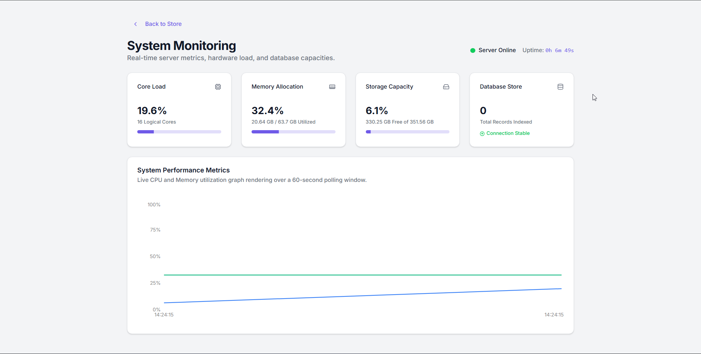
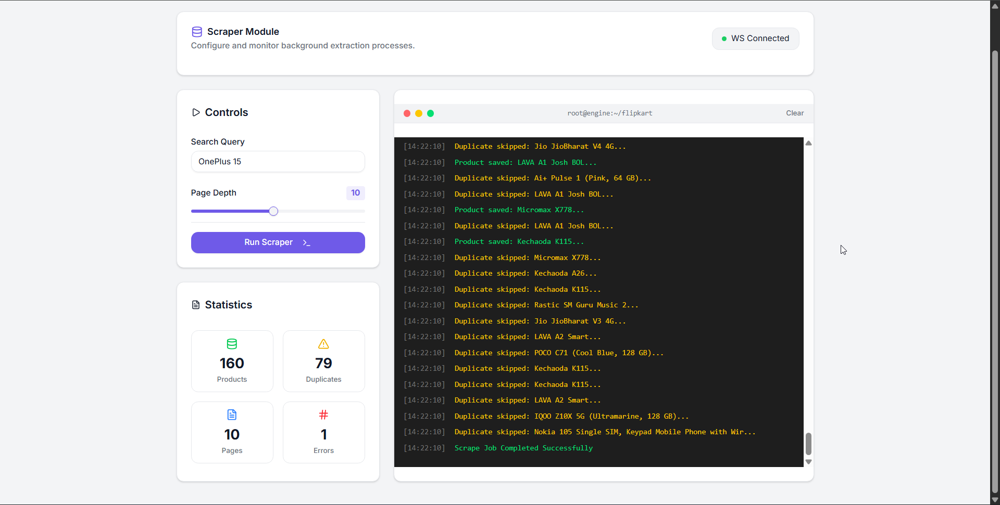
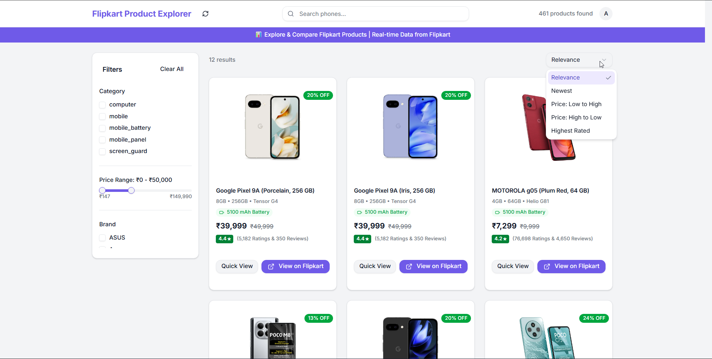
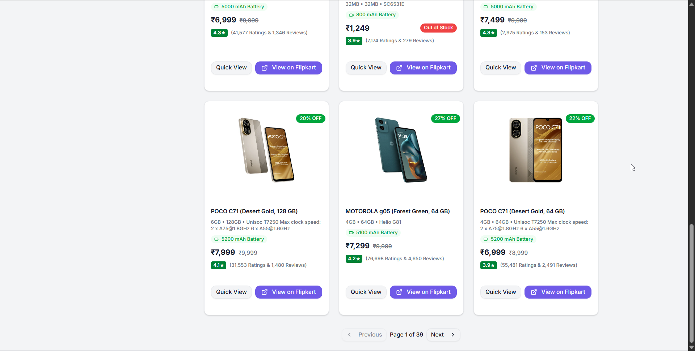
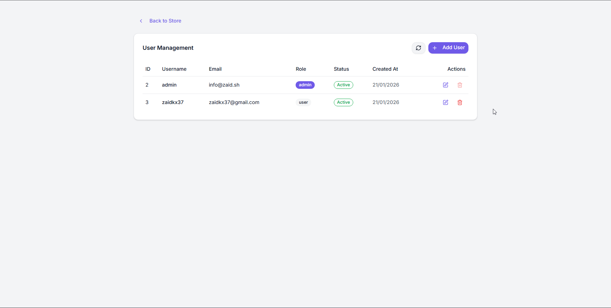
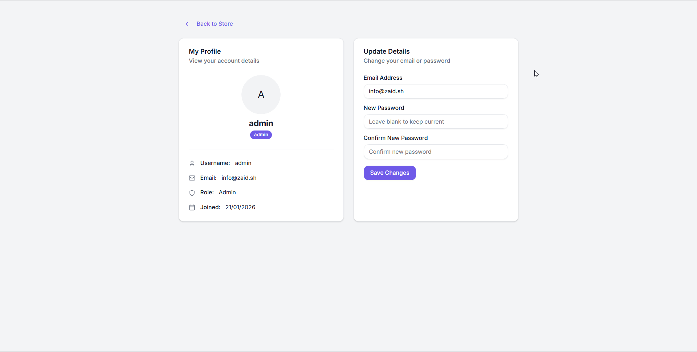
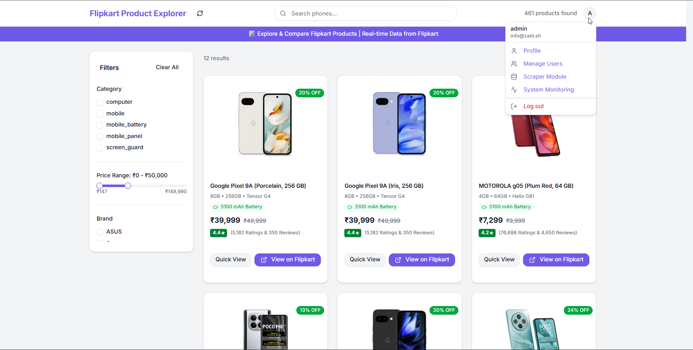
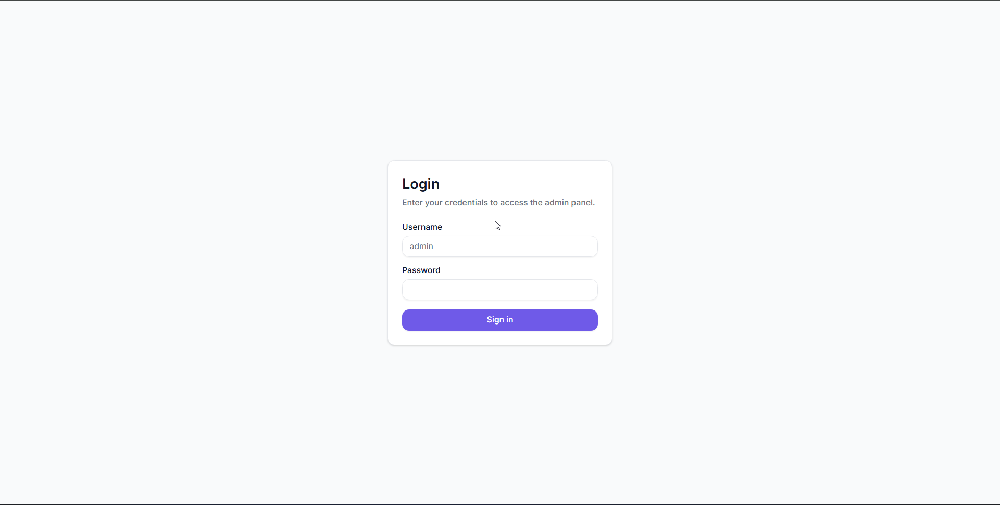

# 🛒 Flipkart Product Scraper

A full-stack web application that scrapes product data from Flipkart and presents it through a modern, responsive web interface. Built with Python FastAPI backend and Next.js React frontend.


## 📸 Screenshots

| Dashboard & Metrics | Scraper Interface |
|:---:|:---:|
|  |  |
| **Search & Filters** | **Data Pagination** |
|  |  |
| **User Management** | **User Profile** |
|  |  |
| **Settings Configuration** | **Authentication** |
|  |  |

## 📋 Table of Contents

- [Screenshots](#-screenshots)
- [Features](#-features)
- [Tech Stack](#-tech-stack)
- [Project Structure](#-project-structure)
- [Prerequisites](#-prerequisites)
- [Installation](#-installation)
- [Configuration](#-configuration)
- [Usage](#-usage)
- [API Documentation](#-api-documentation)
- [Frontend Features](#-frontend-features)
- [Development](#-development)
- [Contributing](#-contributing)
- [License](#-license)


## ✨ Features

### 🕷️ Web Scraping
- **Automated Flipkart scraping** with pagination support
- **Real-time product data extraction** (title, price, rating, specifications)
- **Intelligent retry mechanisms** for robust data collection
- **Duplicate detection** to prevent data redundancy
- **Session management** with cookie handling

### 🗄️ Backend API
- **RESTful API** built with FastAPI
- **MySQL database integration** with SQLAlchemy ORM
- **Advanced search functionality** with fuzzy matching
- **Multiple filtering options** (price, rating, category, brand)
- **Statistical analytics** and trending algorithms
- **Comprehensive error handling** and logging

### 🎨 Frontend Interface
- **Modern React 18+ UI** with Next.js 15
- **Responsive design** with Tailwind CSS
- **Advanced product browsing** with filters and search
- **Interactive image galleries** with navigation
- **Shopping cart functionality** with local storage
- **Real-time data caching** for optimal performance

## 🛠️ Tech Stack

### Backend
- **Python 3.8+** - Core language
- **FastAPI** - Modern web framework
- **SQLAlchemy** - Database ORM
- **MySQL** - Primary database
- **BeautifulSoup4** - HTML parsing
- **curl-cffi** - HTTP requests with CF bypass
- **Pydantic** - Data validation

### Frontend
- **Next.js 15** - React framework
- **React 19** - UI library
- **TypeScript** - Type safety
- **Tailwind CSS** - Styling framework
- **Radix UI** - Component primitives
- **Framer Motion** - Animations
- **Axios** - HTTP client
- **Lucide React** - Icon library

### Development Tools
- **ESLint** - Code linting
- **PostCSS** - CSS processing
- **Git** - Version control

## 📁 Project Structure

```
Flipkart/
├── backend/                    # Python FastAPI backend
│   ├── alchemy/               # Database models and connections
│   │   ├── create_tables.py   # Database schema setup
│   │   ├── database.py        # Database connection and queries
│   │   ├── models.py          # SQLAlchemy models
│   │   └── schemas.py         # Pydantic schemas
│   ├── api/                   # FastAPI application
│   │   ├── main.py           # Application entry point
│   │   ├── routers/          # API route handlers
│   ├── modules/              # Scraping modules
│   │   └── flipkart/        # Flipkart-specific scraper
│   ├── settings/            # Configuration files
│   ├── utils/              # Utility functions
│   └── requirements.txt    # Python dependencies
│
├── frontend/                 # Next.js React frontend
│   ├── src/
│   │   ├── app/             # Next.js app directory
│   │   ├── api/             # API integration layer
│   │   ├── components/      # React components
│   │   │   ├── ui/         # Reusable UI components
│   │   │   └── Storefront.tsx # Main product interface
│   │   ├── hooks/          # Custom React hooks
│   │   └── lib/           # Utility functions
│   ├── public/            # Static assets
│   ├── package.json       # Node.js dependencies
│   └── tailwind.config.js # Styling configuration
│
├── .gitignore            # Git ignore rules
└── README.md           # Project documentation
```

## 🚀 Quick Start Guide

Follow these steps to get the project running on your local machine.

### 1. Prerequisites

Ensure you have the following installed:
- **Python 3.8+** - [Download Python](https://python.org/downloads/)
- **Node.js 18+** - [Download Node.js](https://nodejs.org/)
- **MySQL 8.0+** - [Download MySQL](https://dev.mysql.com/downloads/) or [XAMPP](https://www.apachefriends.org/index.html)
- **Git** - [Download Git](https://git-scm.com/downloads/)

### 2. Clone the Repository

```bash
git clone https://github.com/zaidkx7/flipkart-scraper.git
cd flipkart-scraper
```

### 3. Backend Setup (FastAPI)

1. **Navigate to the backend directory:**
   ```bash
   cd backend
   ```

2. **Create and Activate Virtual Environment:**
   ```bash
   # Windows
   python -m venv venv
   venv\Scripts\activate

   # macOS/Linux
   python3 -m venv venv
   source venv/bin/activate
   ```

3. **Install Dependencies:**
   ```bash
   pip install -r requirements.txt
   ```

4. **Configure Environment Variables:**
   Create a file named `.env` in the `backend` folder and add your database credentials:
   ```ini
   # backend/.env
   MYSQL_HOST=localhost
   MYSQL_USER=root
   MYSQL_PASSWORD=your_password
   MYSQL_DB=flipkart
   ```

5. **Database Setup:**
   First, make sure your MySQL server is running and create the database:
   ```sql
   -- Run this in your MySQL client
   CREATE DATABASE flipkart;
   ```

   Then, create the tables:
   ```bash
   # From the backend directory
   python alchemy/create_tables.py
   ```

6. **Start the Backend Server:**
   ```bash
   python -m uvicorn api.main:app --host 0.0.0.0 --port 8000 --reload
   
   # or

   python api/main.py
   ```
   Server will start at `http://localhost:8000`.

### 4. Frontend Setup (Next.js)

1. **Navigate to the frontend directory:**
   Open a new terminal and run:
   ```bash
   cd frontend
   ```

2. **Install Dependencies:**
   ```bash
   npm install

   # if this doesn't work try this
   npm install --force
   ```

3. **Configure Environment Variables:**
   Create a file named `.env.local` in the `frontend` folder:
   ```ini
   # frontend/.env.local
   NEXT_PUBLIC_API_BASE_URL=http://localhost:8000
   ```

4. **Start the Frontend Development Server:**
   ```bash
   npm run dev
   ```
   The app will be available at `http://localhost:3000`.


The API will be available at: `http://localhost:8000`
- API Documentation: `http://localhost:8000/docs`
- Alternative docs: `http://localhost:8000/redoc`

### Run the Scraper

```bash
cd backend
python modules/flipkart/main.py
```

## 🎨 Frontend Features

### 🔍 Advanced Search & Filtering
- **Real-time search** with debouncing
- **Multi-criteria filtering** (brand, price, rating, specs)
- **Dynamic price range sliders** with Indian currency formatting
- **Category-based browsing**

### 🖼️ Interactive Product Gallery
- **Scrollable image carousel** with left/right navigation
- **Thumbnail gallery** for quick image selection
- **Keyboard navigation** support (arrow keys)
- **Image zoom and full-screen view**

### 🛒 Shopping Cart
- **Add/remove products** with quantity management
- **Persistent cart** using localStorage
- **Price calculations** with tax and shipping
- **Checkout flow** with form validation

### 📱 Responsive Design
- **Mobile-first approach** with Tailwind CSS
- **Adaptive layouts** for all screen sizes
- **Touch-friendly interactions**
- **Fast loading** with optimized images

### ⚡ Performance Features
- **Intelligent caching** with 5-minute TTL
- **Client-side data persistence**
- **Optimized API calls** with fallback mechanisms
- **Loading states** and error boundaries

## 🤝 Contributing

We welcome contributions! Please follow these steps:

1. **Fork the repository**
2. **Create a feature branch**: `git checkout -b feature/amazing-feature`
3. **Commit your changes**: `git commit -m 'Add amazing feature'`
4. **Push to the branch**: `git push origin feature/amazing-feature`
5. **Open a Pull Request**

### Contribution Guidelines

- Follow existing code style and formatting
- Add tests for new features
- Update documentation as needed
- Ensure all tests pass before submitting

## ⚠️ Disclaimer

This project is for educational purposes only. Please ensure you comply with:
- **Flipkart's Terms of Service**
- **Robots.txt guidelines**
- **Rate limiting best practices**
- **Local laws and regulations**

Always respect website policies and implement appropriate delays between requests.

## 📄 License

This project is licensed under the MIT License - see the [LICENSE](LICENSE) file for details.

## 🆘 Support

If you encounter any issues or have questions:

1. Check the [Issues](https://github.com/zaidkx7/flipkart-scraper/issues) page
2. Create a new issue with detailed information
3. Join our discussions in the repository

## 🙏 Acknowledgments

- **FastAPI** for the excellent Python web framework
- **Next.js** for the powerful React framework
- **Tailwind CSS** for the utility-first CSS framework
- **Radix UI** for accessible component primitives
- **Flipkart** for providing the data source

---

<div align="center">

**⭐ Star this repository if you find it helpful!**

Made with ❤️ by [Muhammad Zaid](https://zaid.sh/)

</div>
